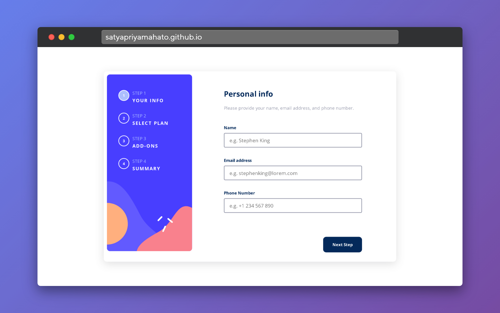

# Frontend Mentor - Multi-step form solution

This is a solution to the [Multi-step form challenge on Frontend Mentor](https://www.frontendmentor.io/challenges/multistep-form-YVAnSdqQBJ). Frontend Mentor challenges help you improve your coding skills by building realistic projects.

## Table of contents

- [Overview](#overview)
  - [The challenge](#the-challenge)
  - [Screenshot](#screenshot)
  - [Links](#links)
- [My process](#my-process)
  - [Built with](#built-with)
  - [What I learned](#what-i-learned)
  - [Continued development](#continued-development)
  - [Useful resources](#useful-resources)
- [Author](#author)
- [Acknowledgments](#acknowledgments)

**Note: Delete this note and update the table of contents based on what sections you keep.**

## Overview

### The challenge

Users should be able to:

- Complete each step of the sequence
- Go back to a previous step to update their selections
- See a summary of their selections on the final step and confirm their order
- View the optimal layout for the interface depending on their device's screen size
- See hover and focus states for all interactive elements on the page
- Receive form validation messages if:
  - A field has been missed
  - The email address is not formatted correctly
  - A step is submitted, but no selection has been made

### Screenshot

### Links

- Solution URL: [Solution](https://github.com/SatyapriyaMahato/multi-step-form)
- Live Site URL: [Live site](https://satyapriyamahato.github.io/multi-step-form/)

## My process

### Built with

- Semantic HTML5 markup
- CSS custom properties
- Flexbox
- Mobile-first workflow
- Javascriupt

### What I learned

I learned more about javascript.

### Continued development

I will exploring more on javascript and get a good grip on it.

### Useful resources

- [w3 schools](https://www.w3schools.com/) - This helped me in uinderstanding the 2s6arrow functions and their syntax.
- [w3 validator](https://validator.w3.org/) - I used this validate my html code to check for any error of deprications.

## Author

- Website - [Satyapriya Mahato](https://satyapriyamahato.github.io/Personal-Site/)
- Frontend Mentor - [@satyapriyamahato](https://www.frontendmentor.io/profile/SatyapriyaMahato)
- Twitter - [@satyapriyamahato](https://www.twitter.com/satyapriyamahto)
